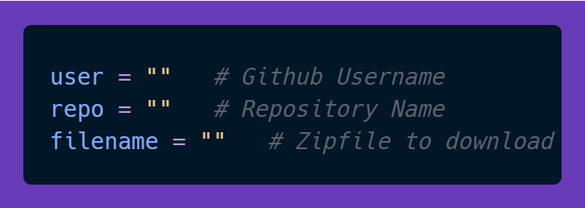

.png>)

  

PyFetchGit is a lightweight Python tool for fetching and installing zipfiles from GitHub repositories' stable releases. It can be used as an update tool for your applications or even games! 👾

## Features ✨

- Fetch and install zipfiles from GitHub repositories' stable releases with ease.
- Automatically downloads the latest stable version from the repository.
- Automatically extracts the zipfile

## Installation 🛠️

Download only the python file [here](https://github.com/sqvdd/pyfetchgit/releases/latest/download/pyfetchgit.py)

1. Clone the repository:

   ```bash
   git clone https://github.com/sqvdd/PyFetchGit.git
   ```

2. Navigate to the cloned directory:

   ```bash
   cd PyFetchGit
   ```

3. Install the dependencies:

   ```bash
   pip install -r requirements.txt
   ```


## Usage 🚀

1. Replace the following variables in the script with your GitHub username, repository name, and filename to download:

   

2. Run the script to download and install the specified file from the GitHub release.

   ```bash
   python pyfetchgit.py
   ```

## Support 🤝

For any questions or issues, please open an [issue](https://github.com/sqvdd/PyFetchGit/issues).
